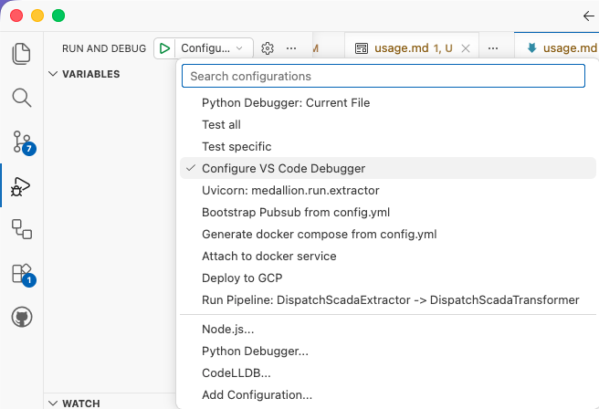

# Usage

## Start a new project

```bash
medallion start MY_NEW_PROJECT_NAME
poetry install --with dev
```

Creates boilerplate for your new project and sets up an example file structure.

## Your business logic implementation

See the `example/` folder for code examples. `example/default/` contains the bare minimum implementation that is also used for your initial default file structure.

## Create debugging configurations for VS Code

This command automatically validates your `config.yml` and creates convenient debugging configurations that you can run using the VS Code debugger.

Inside your project, run:

```bash
medallion vscode
```

Example result (your's may vary):



The last few configurations starting with `Run Pipeline:` are your scraper pipelines, defined in `config.yml`. Run them to launch a debugger for your scraper.

After making changes to your `config.yml`, run the command `Configure VS Code Debugger` to validate it and re-generate the `./launch/config.json` file with updated pipelines.

## Configure Docker workspace

Run the debug configuration `Generate docker compose from config.yml` or execute this command:

```bash
poetry run python -m medallion.configure_entrypoint.generate_docker_compose
```

This validaes your `config.yml` and generates a `docker-compose.yml` and a `docker-compose.debug.yml`

The docker-compose file will:

1. Run an isolated GCP Pub/Sub emulator host as microservice
2. Run a microservice for each transformer from your `config.yml` file, as well as a store for each queue. The storage type is mounted to your local folder `.medallion-root`, which is meant to re-use the data folder you use for local runs.
3. Run a microservice for each extractor, that listens on port 8001, 8002, ..., 8000+n for n extractors.

To use it, run:

```bash
EXTRACTOR_API_KEY=YOUR_API_KEY docker compose up [--build]
```

To trigger an extractor, run:

```bash
curl --location --request POST 'http://0.0.0.0:EXTRACTOR_PORT' \
--header 'X-Extractor-Api-Key: YOUR_API_KEY'
```

### Debugging inside of Docker container

To run a debugger in a docker container, have a look at the `docker-compose.debug.yml` file generated together with `docker-compose.yml`. It picks the first extractor from the compose by default. Modify the service name to debug any other service from your `docker-compose.yml`.

Run:

```bash
docker compose -f docker-compose.yml -f docker-compose.debug.yml up [--build]
```

Once all containers are ready and their logs indicate that they're listening, run the debugging configuration `Attach to docker service`.

## Configure GCP Deployment

## Run an Extractor as HTTP Server

If you need to debug the extractor HTTP server alone, which usually only runs inside docker or in production, you may want to use this entrypoint instead of running the entire fleet in docker.

```bash
EXTRACTOR_CLASS=MY_EXTRACTOR poetry run uvicorn medallion.run.extractor:app --host 0.0.0.0 --port 8080
```
